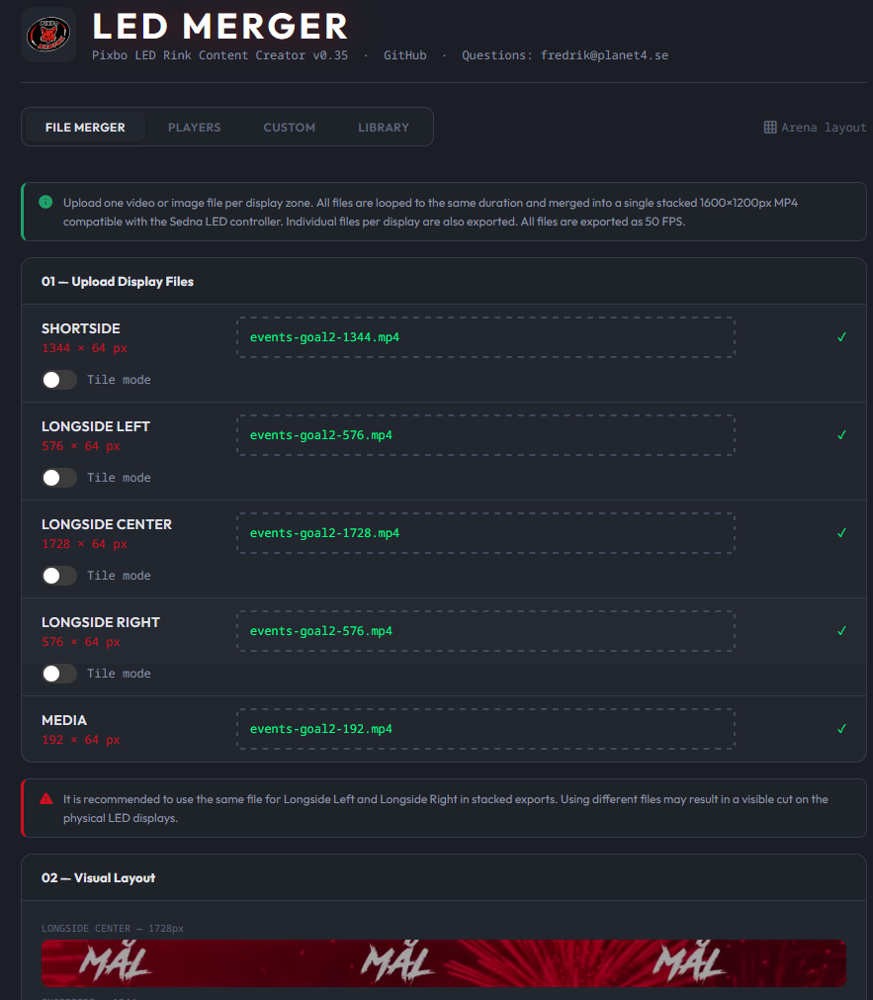
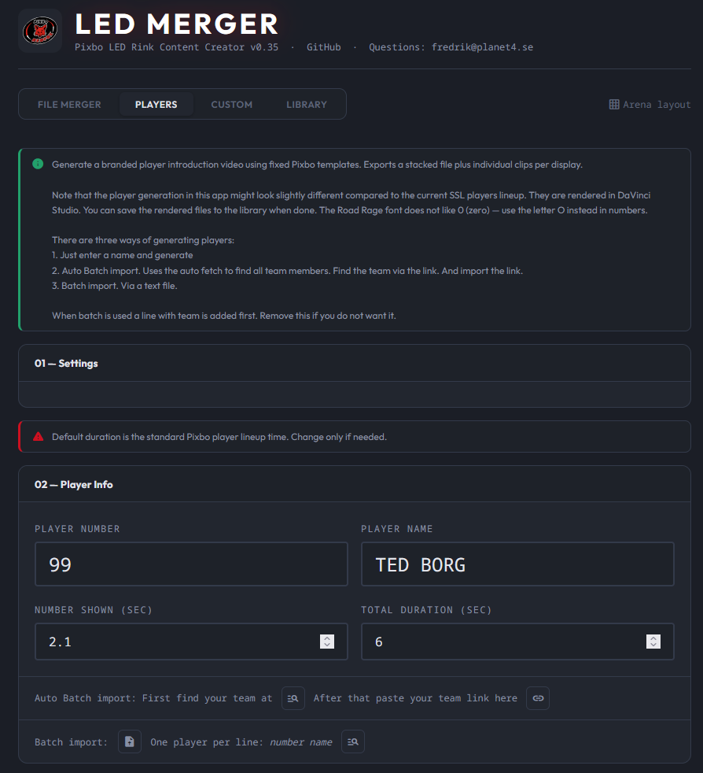
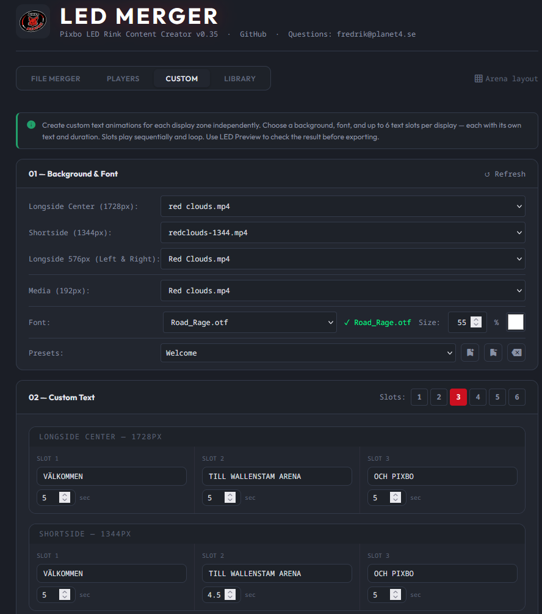
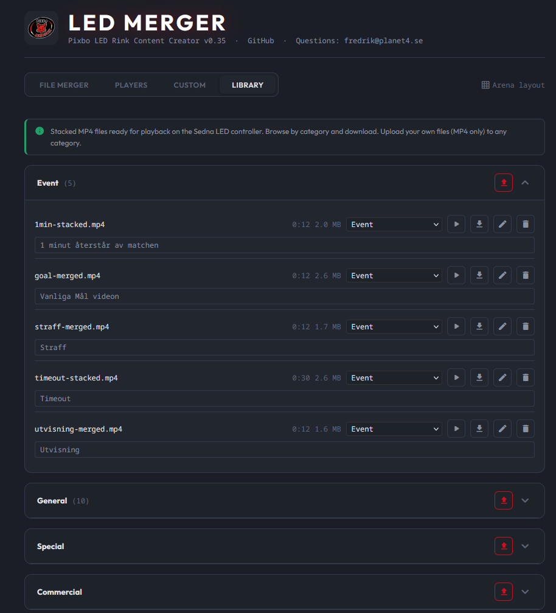

# LedMerger — Pixbo LED Rink Content Creator v0.405

A web-based tool for creating and merging LED rink content for Wallenstam Arena (Pixbo Floorball). Produces stacked MP4 files compatible with the Sedna LED controller.

## Screenshots

| | |
|---|---|
|  |  |
| *File Merger* | *Players* |
|  |  |
| *Custom* | *Library* |

## What it does

- **File Merger** — Upload individual video/image files for each display zone and merge them into one stacked 1600×1200px MP4
- **Players** — Generate branded player introduction videos using fixed Pixbo templates with Road Rage font and pop-wobble animation. Supports batch import and single player mode.
- **Custom** — Create custom text animations for any display zone with configurable backgrounds, fonts, colors, and timing
- **Library** — Store and share finished stacked MP4 files, organized by category (built-in categories, plus add your own on the fly), sorted by how much you actually use each one. Each file gets an **LED Preview** — a popup simulator with three views: Arena View (overlaid on an arena photo), Merged File (the actual exported file, played directly), and Separate Files (each display's own feed, pixel-grid style). Download a whole category at once as a `.zip`.

All tabs produce a stacked 1600×1200px export matching the After Effects / ledventure.org reference layout, plus individual files per display.

## Display layout

| Display | Width | Height |
|---------|-------|--------|
| Shortside | 1344px | 64px |
| Longside Left | 576px | 64px |
| Longside Center | 1728px | 64px |
| Longside Right | 576px | 64px |
| Media | 192px | 64px |

The stacked export folds all displays into a 1600px wide canvas across 5 rows (320px content + black padding to 1200px), matching the physical LED strip wiring at the arena.

## Folder structure

```
ledmerger/
├── app.py
├── Dockerfile
├── docker-compose.yml
├── requirements.txt
├── templates/
│   ├── index.html
│   └── led_preview.html
└── data/
    ├── uploads/          — temporary upload storage
    ├── outputs/          — generated video files
    ├── library/           — saved library files, one folder per category
    │   ├── categories.json — user-added categories, on top of the built-in set
    │   ├── metadata.json    — per-file descriptions + cached duration
    │   └── <category>/.led_preview/ — cached per-display clips for LED Preview
    ├── backgrounds/
    │   ├── 1728/         — 1728px backgrounds (Longside Center)
    │   ├── 1344/         — 1344px backgrounds (Shortside)
    │   ├── 576_variants/ — 576px variant backgrounds (Players/Custom)
    │   ├── media_192/    — 192px media backgrounds
    │   └── layout.png    — arena layout reference image
    └── fonts/            — custom font files (.ttf, .otf)
```

## Player template files

The Players tab requires these fixed template files. **The filenames are hardcoded — do not rename them.**

```
data/backgrounds/1728/players-template-1728.mp4
data/backgrounds/1344/players-template-1344.mp4
data/backgrounds/576_variants/players-template-576.mp4
data/backgrounds/media_192/players-template-192.mp4
```

All other files in `1728/` and `1344/` are freely renameable — they only appear as dropdown options in the UI.

## Running with Docker

```bash
# Build and start
sudo docker compose up -d --build

# Open in browser
http://localhost:5000

# From another device on the network
http://<server-ip>:5000
```

## Updating

After changing **any** file (including templates — they are baked into the image, and `FLASK_ENV=production` disables auto-reload):
```bash
sudo docker compose up -d --build
```

Then hard refresh the browser (Ctrl+Shift+R).

## Login & configuration

The app requires a login (server-side session). The password is set via the `APP_PASSWORD` environment variable, kept in a gitignored `.env` file (see `.env.example`) — the repo is public, so the password is **not** committed. Other env vars in `docker-compose.yml`:

- `TEAMSCRAPER_BASE` — teamscraper service URL for the Players "Pick team" feature (default `http://192.168.0.140:5020`).
- `FLASK_ENV=production`.

The session secret is stored at `data/library/.secret_key` (auto-generated). Keep it across host moves so existing logins survive; losing it just forces a re-login.

## Moving to a new host

Copy the repo, recreate `.env`, and copy the `data/` volumes — `data/library` is the irreplaceable content; `data/outputs` and `data/uploads` are disposable. Then point the swag reverse proxy (which lives outside this repo) at the new host's port 5000. See `CLAUDE.md` → "Hosting & migration" for the full checklist.

## Cleaning up output files

```bash
rm -f data/outputs/*.mp4
rm -f data/uploads/*
```

## Supported input formats

MP4, MOV, AVI, GIF, PNG, JPG/JPEG

## Notes

- Longside Left and Right should use the same source file in stacked exports to avoid visible cuts on the physical displays
- The Players tab uses Road Rage font and white text — fixed and not configurable
- Default player timing is 2.1s number + 3.9s name = 6s total (standard Pixbo lineup time)
- Road Rage font does not render the digit 0 well — use the letter O instead in player numbers
- Output files in all tabs include preview, download, rename, and save-to-library actions
- `data/outputs/` and `data/uploads/` are working folders, not the library — always safe to clear, since nothing in the library depends on them (library saves are full copies)
- **They are wiped automatically every night at midnight** by a background thread in `app.py` (`_daily_cleanup`). Anything you generate but don't save to the Library is gone the next day — save what you want to keep
